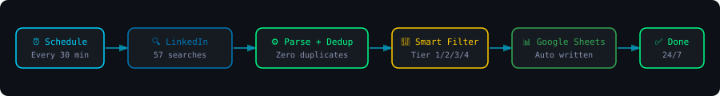

<div align="center">


# LinkedIn Job Tracker — Automated Job Search Engine

**Stop searching manually. Let the machine do it.**

Automatically hunts LinkedIn every 30 minutes across 57 keyword + city combinations, classifies companies by tier, deduplicates everything, and writes clean structured data directly to Google Sheets — 24/7, zero manual effort.

[](https://n8n.io)
[](https://linkedin.com)
[](https://sheets.google.com)
[](#)
[](#)
[](#)
[](#)

</div>

---

## The Problem

Every CS student and job seeker knows this pain:

- Open LinkedIn → search manually → copy job link → check if you already saved it → repeat 50 times
- Spend **2–3 hours daily** just finding jobs, not applying
- Miss great opportunities because you didn't search at the right time
- No system. No structure. Just chaos.

**This project eliminates that entirely.**

---

## How It Works



1. **Trigger** — Fires automatically every 30 minutes via scheduler
2. **Search** — 57 parallel searches across keywords, cities, time windows
3. **Parse** — Extracts company, title, location, skills, salary from raw data
4. **Classify** — Tags every company as Tier1 / Tier2 / Tier3 / Tier4
5. **Deduplicate** — Checks against every job ID ever written — zero repeats ever
6. **Write** — Appends only new jobs to Google Sheets instantly

---

## Features

### 🔍 57 Parallel LinkedIn Searches
Covers every angle — no job slips through:

| Category | Searches |
|----------|----------|
| Software Engineering | SDE, Backend, Frontend, FullStack |
| AI / ML | Machine Learning, Data Science, NLP |
| Mobile | Flutter, Android, iOS, React Native |
| DevOps / Cloud | AWS, Docker, Kubernetes, SRE |
| City-specific | Chennai, Bangalore, Hyderabad, Mumbai, Pune |
| Fresh windows | Last 1h, 2h, 4h, 6h, 24h, 7d, 15d |
| Internships | Intern, Fresher, Trainee, Entry Level |

### 🏢 Intelligent Company Tier Classification

Automatically classifies every company the moment a job is found:

| Tier | Companies | Color |
|------|-----------|-------|
| **Tier 1 — World Class** | Google, Microsoft, Amazon, Meta, Anthropic, OpenAI, Stripe, Figma... | 🟢 |
| **Tier 2 — Indian Unicorn** | Razorpay, Zepto, Swiggy, CRED, Groww, Zerodha, Freshworks... | 🔵 |
| **Tier 3 — Global MNC** | TCS, Infosys, Wipro, Cognizant, IBM, Oracle, SAP... | 🟡 |
| **Tier 4 — Other** | All other companies | ⚪ |

### 📊 Google Sheets Output — 16 Columns

Every job written with full structured data:

```
Date | Time | Company | Tier | Title | Location | Job URL |
Exp Level | Required Skills | Type | Salary | Status | HR Search | Source | Job ID | Posted Date
```

### 🛡️ Zero Duplicate Guarantee
- Reads all existing Job IDs before every run
- Checks every new job against the full history
- Skips exact duplicates — always
- Works even if you run it 100 times manually

### 🚫 Smart Quality Filters
Automatically removes:
- MLM / Network marketing / commission-only roles
- Fake recruitment agencies
- VP / Director / C-suite roles (too senior)
- Unpaid positions

---

## Tech Stack

| Tool | Purpose |
|------|---------|
| **n8n** | Workflow automation engine — all orchestration |
| **LinkedIn** | Primary job data source via job search |
| **Google Sheets** | Output storage — structured, shareable |
| **Node.js** | Custom parsing and dedup logic inside n8n Code node |

> No paid scrapers. No third-party job boards. Pure automation.

---

## Results

> Built this after getting frustrated with manual job searching during placements.

| Metric | Value |
|--------|-------|
| Jobs tracked in first 24h | **110+** |
| Searches per run | **57** |
| Run frequency | **Every 30 minutes** |
| Duplicates written | **0** |
| Manual effort required | **0** |
| Cost | **Free** |

---

## Setup Guide

### Prerequisites
- [n8n](https://n8n.io) installed (self-hosted or cloud)
- Google account with Sheets access
- 15 minutes

### Step 1 — Import Workflow
1. Clone this repo
2. Open your n8n instance
3. Click **+** → **Import from file**
4. Upload `workflow.json`

### Step 2 — Connect Google Sheets
1. Open the **Fetch Existing IDs** node
2. Add your Google Sheets credential
3. Update `spreadsheet_id` to your sheet ID

### Step 3 — Create Your Google Sheet
Create a sheet with this header row in **Sheet1**:
```
Date Applied | Time | Company | Tier | Job Title | Location | Job URL | 
Experience Level | Required Skills | Employment Type | Salary Hint | 
Status | HR Recruiter Search | Source | Job ID | Posted Date
```

### Step 4 — Activate
Toggle the **Active** switch ON in the top right.

Done. It runs every 30 minutes automatically.

---

## The Story Behind This

This didn't come in one shot.

```
V1 — fetched 2 jobs. duplicates everywhere.
V2 — dedup fixed. but missed half the listings.
V3 — added more searches. crashed after 10 min.
V4 — stable. but only 5 jobs per run. not enough.
V5 — expanded keywords. 20 jobs. but wrong roles showing.
V6 — added filters. clean data. but scheduler broke.
V7 — scheduler fixed. but last node never ran.
V8 — 57 searches. 110+ jobs. zero duplicates. runs every 30 min. ✅
```

8 versions. Countless bugs. Zero shortcuts.

---

## Project Structure

```
linkedin-job-tracker/
├── workflow.json          # n8n workflow — import this
├── banner.svg             # Project banner
├── workflow-diagram.svg   # How it works diagram
├── docker-compose.yml     # Run n8n locally via Docker
└── README.md
```

---

## Roadmap

- [ ] Telegram instant alerts when Tier1/Tier2 jobs found
- [ ] Job relevance scoring (1–10 based on your skills)
- [ ] Daily email digest — top 10 jobs at 9am
- [ ] Auto color-coding in Google Sheets by tier
- [ ] Resume-to-job match percentage

---

## Contributing

Pull requests welcome. Open an issue for any bugs or feature requests.

---

## License

MIT — free to use, modify, and share.

---

<div align="center">

**Built by [Vignesh S](https://github.com/vignesh2027)**

*Takshashila University · CSE 2022–26 · Chennai*

⭐ Star this repo if it helped you

</div>
